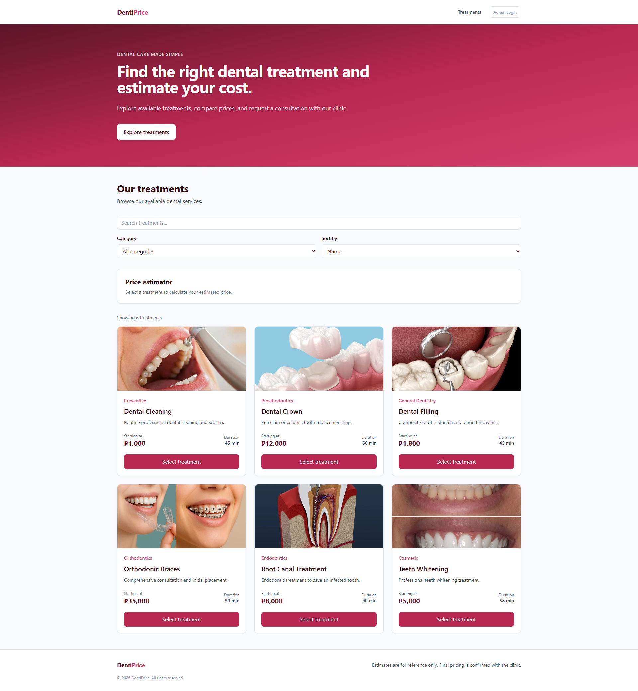

# DentiPrice

DentiPrice is a dental price estimation and consultation management web application. It allows patients to estimate dental treatment costs, select procedures and optional add-ons, and submit consultation requests. Administrators can securely manage inquiries, patients, appointments, scheduling, and patient history.

## My project repository

Public repository: https://github.com/rdmanangu/Dentiprice

Live app: https://dentiprice.onrender.com
---

## Screenshots

### Patient-facing home page



---

## What it is

DentiPrice is a web-based dental price estimator and consultation management system designed to make the initial dental consultation process easier for patients and administrators.

### Public patient features

Patients can:

- Browse available dental procedures
- View procedure prices
- Select a dental treatment
- Select optional treatment add-ons
- See an estimated total price
- Submit a consultation request
- Provide their name, phone number, and email address
- Select a preferred consultation date
- Select a preferred time slot
- Receive a clear confirmation after submitting a consultation request

The public estimator provides an **estimated price only**. The displayed amount is not a final dental quotation or treatment plan.

### Administrative features

Authorized administrators can:

- Log in through Supabase Authentication
- View and manage consultation inquiries
- Filter inquiries by status
- View inquiry details and selected treatments
- Confirm and schedule consultations
- Manage appointments
- Update appointment statuses
- Reschedule appointments
- Add administrative appointment notes
- View appointment details
- View patient records
- Search patients by name, phone number, or email
- View patient history
- View inquiries and appointments associated with a patient
- View upcoming appointments
- Use scheduling and calendar views
- Manage dental procedures and treatment add-ons
- Monitor operational dashboard information

### Main workflow

```text
Patient
   |
   v
Browse Procedures
   |
   v
Select Treatment
   |
   v
Select Optional Add-ons
   |
   v
Calculate Estimated Price
   |
   v
Submit Consultation Request
   |
   v
Pending Inquiry
   |
   v
Admin Confirms & Schedules
   |
   v
Scheduled Appointment
   |
   +--------------------+
   |                    |
   v                    v
Completed          Cancelled / No Show
```

A submitted consultation request is **not automatically a confirmed appointment**.

---

## How to run it

### Requirements

Before running DentiPrice, install:

- Node.js
- npm
- Git
- A Supabase project

You will also need access to the project's Supabase database and authentication configuration.

### 1. Clone the repository

```bash
git clone https://github.com/rdmanangu/Dentiprice.git
cd Dentiprice
```

### 2. Install dependencies

```bash
npm install
```

### 3. Configure environment variables

Create a `.env.local` file in the project root.

Use example values like:

```env
VITE_SUPABASE_URL=https://your-project.supabase.co
VITE_SUPABASE_PUBLISHABLE_KEY=your-supabase-publishable-key
```

Do not place real credentials in this README or commit private credentials to Git.

### 4. Set up Supabase

Create a Supabase project and open the Supabase SQL Editor. The six SQL files in
`supabase/migrations/` are incremental migrations for the patient and appointment
workflows; they are not a complete fresh-database bootstrap. They assume the
base `procedures`, `add_ons`, `inquiries`, and `inquiry_items` tables already
exist. The repository does not include the SQL that creates that base schema.
Set up the base schema first, then apply the tracked migrations in filename
order. Do not treat this repository alone as sufficient to initialize a new,
empty Supabase database.

The application uses PostgreSQL tables including:

- `patients`
- `inquiries`
- `inquiry_items`
- `appointments`
- `appointment_items`
- `procedures`
- `add_ons`

The database also uses:

- Foreign-key relationships
- Row Level Security (RLS)
- PostgreSQL functions
- PostgreSQL triggers
- Unique indexes
- Status transition validation
- Secure inquiry submission
- Appointment workflow protection

### 5. Configure authentication

Create an administrator account using Supabase Authentication.

The administrator must have the appropriate administrator role in the Supabase authentication metadata.

The application checks the authenticated user's administrator role before allowing access to protected administrative functionality.

Creating an account alone is not enough. A new Supabase user has empty `app_metadata`, so the
application treats it as a signed-in non-admin and returns it to the login page. Grant the role
explicitly, per account, from the Supabase SQL editor:

```sql
-- Grant admin to one specific account. Replace the email, and only
-- run this for a staff member you have approved.
update auth.users
set raw_app_meta_data = raw_app_meta_data || '{"role":"admin"}'::jsonb
where email = 'staff@clinic.com';
```

The same value can be set in the Supabase dashboard under **Authentication → Users → Edit user →
User Metadata → app_metadata**. Grant the role this way rather than with `user_metadata`, which is
writable by the account holder and is not trusted by the Row Level Security policies.

There is no self-service registration in DentiPrice: staff accounts are provisioned by the clinic
owner, and only accounts holding the admin role can reach the admin panel.

Do not put administrator passwords or private authentication credentials in the repository.

### 6. Start the development server

```bash
npm run dev
```

The default development URL is normally:

```text
http://localhost:5173
```

### 7. Build the application

```bash
npm run build
```

### 8. Preview the production build

```bash
npm run preview
```

---

## Database structure

DentiPrice uses Supabase/PostgreSQL as its application database.

The main relationships are:

```text
patients
   |
   +---- inquiries
   |
   +---- appointments
             |
             +---- appointment_items

inquiries
   +---- inquiry_items
   +---- zero or one appointment
```

Each appointment belongs to a patient and may be linked to its originating
inquiry. The database has a unique partial index allowing at most one linked
appointment per inquiry. Inquiry and appointment items store treatment/add-on
name and price snapshots so later catalog changes do not rewrite those item
details.

### Patients

The `patients` table stores patient information such as:

- Full name
- Phone
- Email
- Date of birth
- Administrative notes
- Creation date
- Last update date

### Inquiries

An inquiry represents a patient's consultation request.

An inquiry contains:

- Patient
- Calculated estimated price
- Preferred consultation date
- Preferred time slot
- Inquiry status
- Creation and update timestamps

Inquiry statuses are:

```text
pending
confirmed
cancelled
completed
```

### Inquiry items

Inquiry items store the procedures and add-ons selected when the consultation request was submitted.

### Appointments

Appointments represent scheduled consultations.

Appointment statuses are:

```text
scheduled
confirmed
completed
cancelled
no_show
```

### Appointment items

Appointment items store the treatment snapshot associated with an appointment. This prevents later catalogue price changes from rewriting historical appointment information.

---

## Inquiry and appointment workflow

### Inquiry status workflow

```text
pending
  |
  +----> confirmed
  |
  +----> cancelled

confirmed
  |
  +----> completed
```

Cancelled and completed inquiries are terminal states.

### Appointment status workflow

```text
scheduled
  |
  +----> confirmed
  |
  +----> completed
  |
  +----> cancelled
  |
  +----> no_show

confirmed
  |
  +----> completed
  |
  +----> cancelled
  |
  +----> no_show
```

Database-level protections are used together with frontend validation so workflow rules are not dependent only on the user interface.

---

## Security

DentiPrice uses Supabase Authentication and PostgreSQL authorization controls to protect administrative and patient-related data.

Security features include:

- Supabase Authentication
- Administrator role verification
- Protected admin routes
- PostgreSQL Row Level Security
- Database-side authorization
- Secure PostgreSQL functions
- Foreign-key constraints
- Unique indexes
- Workflow status validation
- Appointment duplication protection
- Patient relationship protection
- No service-role credentials in the frontend

The public website does not directly create appointments. Public users submit consultation requests through the controlled inquiry workflow.

---

## Data privacy

The application handles personal information such as:

- Patient names
- Phone numbers
- Email addresses
- Dates of birth
- Administrative notes
- Consultation information
- Appointment information

Patient-related administrative functionality is protected by authentication and database authorization.

Real credentials, passwords, private API keys, or service-role keys should never be committed to the repository.

---

## User interface

The public interface provides:

- Responsive navigation
- Dental procedure cards
- Procedure selection feedback
- Add-on selection
- Estimated pricing
- Consultation request form
- Form validation
- Loading states
- Error states
- Submission confirmation
- Responsive mobile layout
- Accessibility-related form attributes

The administrative interface provides:

- Dashboard
- Inquiry management
- Scheduling
- Appointment management
- Patient management
- Patient history
- Appointment details
- Inquiry details
- Status filters
- Date filters
- Loading states
- Empty states
- Error handling

---

## Technology used

### Frontend

- React
- TypeScript
- Vite
- Tailwind CSS
- React Router

### Backend and database

- Supabase
- PostgreSQL
- Supabase Authentication
- Row Level Security
- PostgreSQL functions
- PostgreSQL triggers

### Development tools

- npm
- ESLint
- Git
- GitHub

---

## Project structure

A simplified project structure is:

```text
project/
├── src/
│   ├── components/
│   │   ├── admin/
│   │   ├── auth/
│   │   ├── estimator/
│   │   ├── inquiries/
│   │   ├── layout/
│   │   ├── procedures/
│   │   └── ui/
│   │
│   ├── pages/
│   │   ├── AdminLogin.tsx
│   │   ├── AdminDashboard.tsx
│   │   ├── Home.tsx
│   │   ├── InquiriesPage.tsx
│   │   ├── PatientsPage.tsx
│   │   ├── PatientDetailsPage.tsx
│   │   ├── SchedulingPage.tsx
│   │   └── TreatmentsPage.tsx
│   │
│   ├── services/
│   │   ├── appointments.ts
│   │   ├── addons.ts
│   │   ├── dashboard.ts
│   │   ├── inquiries.ts
│   │   ├── patients.ts
│   │   └── procedures.ts
│   │
│   ├── lib/
│   ├── types/
│   ├── App.tsx
│   └── main.tsx
│
├── supabase/
│   └── migrations/
│
├── public/
├── package.json
└── README.md
```

---

## Running checks

Before submitting or deploying the project, run:

```bash
npm install
npm run build
```

If linting is configured:

```bash
npm run lint
```

---

## Presentation

- **Video:** https://drive.google.com/file/d/19UyjqHshRitB5XWvFzxs3tRU2H3nTayW/view?usp=drive_link
- **Slides:** https://docs.google.com/presentation/d/18vAWir6xbZcT3tFdDblDrMCyUFzhCLWE/edit?usp=drive_link&ouid=109011297119006716577&rtpof=true&sd=true
- **Square image:** https://drive.google.com/file/d/1lMf6p7oQXyys2ctk7X0GnGKdbV9_7Gwc/view?usp=drive_link

---

## AI usage

AI tools were used during the development of DentiPrice as development assistance.

AI assistance was used for:

- Planning application architecture
- Writing and reviewing code
- Debugging frontend errors
- Debugging Supabase and PostgreSQL issues
- Reviewing database relationships
- Writing SQL migrations
- Reviewing Row Level Security policies
- Improving frontend user experience
- Improving form validation
- Improving accessibility
- Reviewing authentication and authorization
- Reviewing workflow logic
- Generating testing and quality-assurance checklists
- Preparing project documentation

AI-generated suggestions were reviewed and adapted during development rather than being treated as automatically correct.

Detailed AI usage information is available in `AI-USAGE.md`.

Repository link:

https://github.com/rdmanangu/Dentiprice/blob/main/AI-USAGE.md

---

## Project documentation

- [Documentation index](docs/README.md)
- [Project proposal](docs/01-proposal.md)
- [Mockups](docs/02-mockup.md)
- [Design system](docs/03-design-system.md)
- [Weekly reports](docs/04-weekly-reports.md)
- [Demo video script](docs/05-demo-video.md)
- [Security and privacy](docs/06-security-and-privacy.md)
- [Security checklist](SECURITY-CHECKLIST.md)
- [AI usage](AI-USAGE.md)

---

## Limitations

DentiPrice is an academic/project application and is intended to demonstrate a dental price estimation and consultation management workflow.

The application does not attempt to provide:

- Medical diagnosis
- Clinical decision-making
- Automated treatment planning
- Electronic medical records
- Billing or payment processing
- Insurance processing
- Provider/resource scheduling
- Patient self-service medical records
- Automated clinical recommendations

The displayed prices are estimates and may differ from the final cost determined after professional dental assessment.

---

## Disclaimer

DentiPrice provides estimated dental treatment prices for consultation and planning purposes.

The estimated price displayed by the application is not a diagnosis, final treatment plan, or official dental quotation.

Actual treatment costs may vary depending on the patient's dental condition, clinical assessment, materials, procedures required, and the final treatment plan determined by the dental professional.

Submitting a consultation request does not automatically confirm an appointment. Appointment confirmation and scheduling are handled through the administrative workflow.

---

## Project status

- [x] Public dental price estimator
- [x] Dental procedure selection
- [x] Optional treatment add-ons
- [x] Estimated total calculation
- [x] Consultation inquiry submission
- [x] Inquiry validation
- [x] Admin authentication
- [x] Inquiry management
- [x] Inquiry status management
- [x] Confirm and Schedule workflow
- [x] Appointment management
- [x] Appointment status management
- [x] Appointment rescheduling
- [x] Patient records
- [x] Patient search
- [x] Patient history
- [x] Scheduling page
- [x] Admin treatment and add-on management
- [x] Calendar/dashboard views
- [x] Administrative dashboard
- [x] Supabase database integration
- [x] Row Level Security
- [x] Database workflow protections
- [x] Responsive public interface
- [x] Responsive administrative interface
- [x] Form accessibility improvements

---

## Future improvements

Possible future improvements include:

- Automated appointment reminders
- Email or SMS notifications
- Online payment integration
- More advanced calendar functionality
- Automated testing and end-to-end testing
- Improved production monitoring
- Additional reporting and analytics
- More detailed accessibility testing
- Additional deployment automation

These features are outside the core scope of the current project.

---
## Author

Redenelle Maurice Manangu

## License

This project was created as an academic/project submission.
This project is licensed under the [MIT License](LICENSE).

